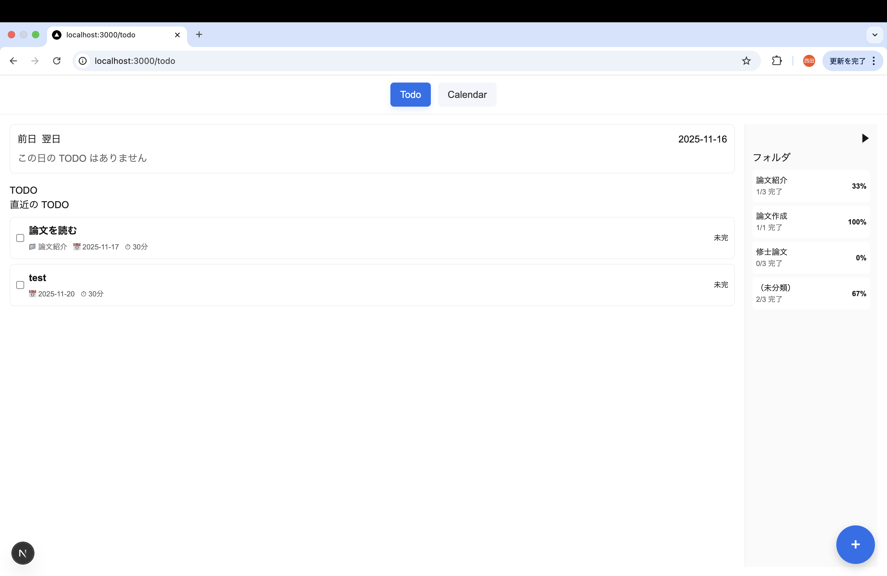
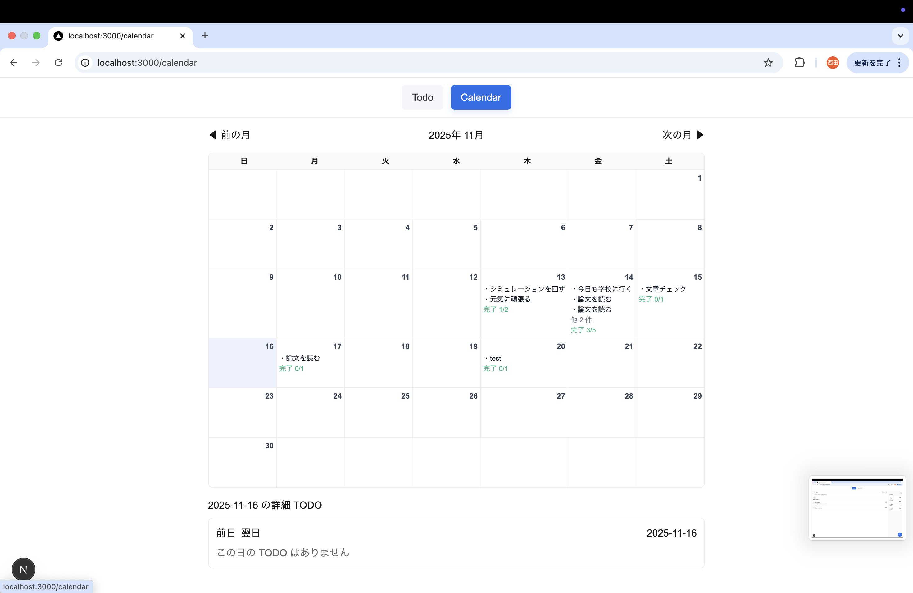
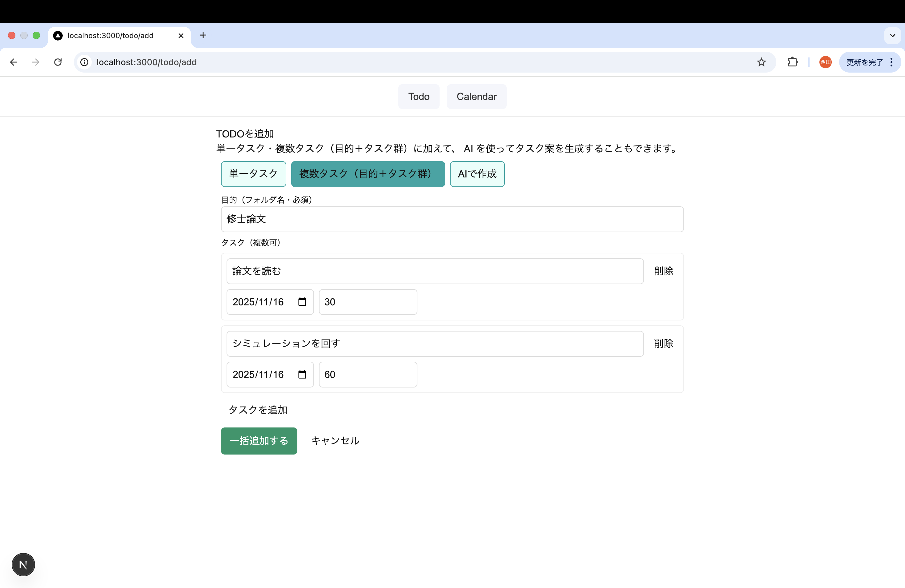
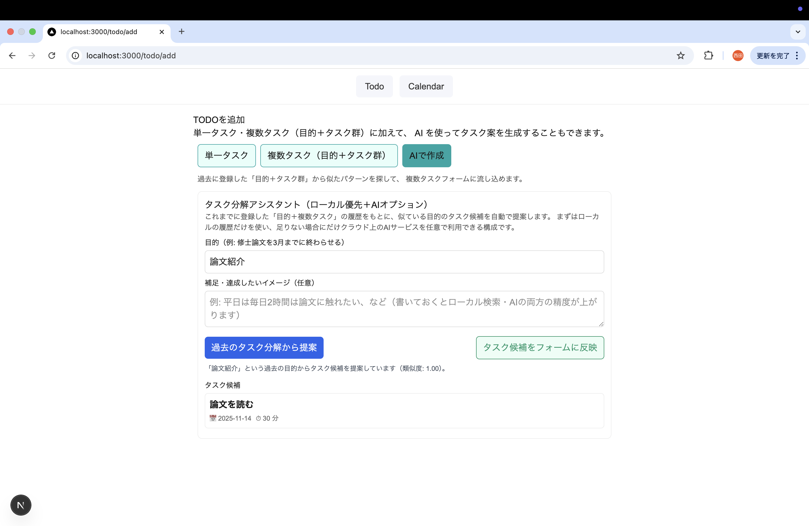

# PD-Calendar（目的分解カレンダー）

## 概要

PD-Calendar は、カレンダー管理・フォルダ管理・AIタスク分解を統合した個人向けタスク管理ツールです。

特徴的なのは、ユーザーが作成した「目的＋タスク群」の履歴を学習し自分自身の思考に最適化されたタスク分割テンプレートが自動で育っていく点です。

シンプルな UI で毎日のタスクを管理しつつ使えば使うほど「自分に合ったタスク提案」が得られることを目指して設計しています。

---

## 画面イメージ・デモ

### トップ（今日のタスク＋フォルダ＋追加ボタン）


### カレンダー画面


### 目的＋複数タスク追加フォーム


### AIタスク提案パネル（TaskIdeasPanel）


## デモ映像

### 基本的な流れ
https://youtu.be/xxxaAPHY6hs

### 進捗状況とリスケジュール
https://youtu.be/uiNGUaYz3Dw

### AI提案 → 複数タスクフォームに流し込む様子：  
https://youtu.be/-jjEljktZoE

### カレンダーの使い方
https://youtu.be/YJl_itLSu3o


## コアコンセプト

### 1. 「目的＋タスク群」の履歴を学習し、個人最適化されたテンプレートに育てる

複数タスク追加時に、以下の情報を `taskPatterns` コレクションとして保存します。

- 目的（例: 「修士論文の関連研究をまとめる」）
- その目的のために分解したタスク群（タイトル・日付・想定時間など）

次回以降、ユーザーが類似した目的を入力すると、  
過去のパターンとの類似度を計算して、もっとも近いパターンからタスク群を候補として生成します。

これにより、利用を重ねるほど以下のような「自分の癖」がテンプレートとして蓄積されます。

- どのような粒度でタスクを分解するか
- どんな順番で作業を進めるか
- よく使うタスク名・言い回し
- 目的ごとの典型的なタスク構造

アプリはこれを「自分専用のタスク分解辞書」として再利用します。

---

### 2. ローカル辞書優先＋不足時のみ LLM を呼ぶハイブリッド構成

タスク提案時の基本方針は以下です。

1. まず Firestore 上の `taskPatterns` から類似目的のパターンを検索  
2. 類似度が一定しきい値を下回る場合のみ、OpenAI API を使ってタスク候補を生成

これにより、

- データが蓄積されるほどローカルだけで完結しやすくなる
- LLM の利用回数とコストを抑えられる
- 個人の履歴に適応したタスク提案が可能になる

という性質を持つ設計になっています。

---
## 技術スタック（Technology Stack）
### フロントエンド
#### Next.js 14 (App Router)
- ファイルベースルーティング
- Server / Client Components の併用
- API Routes（app/api/...）の利用

#### React 18
- Hooks ベースの設計（useState, useEffect, useRouter などを使用）

#### TypeScript
- 型安全なフォーム構造
- コンポーネント間の型共有（addTodoTypes.ts など）

#### Tailwind CSS v4
- カスタムテーマ（globals.css）
- 簡易 UI 設計を高速化
- インラインテーマ変数による配色統一

### バックエンド / データベース
#### Firebase Firestore
- plans コレクション：タスク本体
- taskPatterns コレクション：目的＋タスク群の学習データ
- folders コレクション：フォルダメタ情報
- Realtime updates（onSnapshot）

#### Firebase SDK (Modular v9)
- addDoc, updateDoc, getDoc, getDocs, query など
- Next.js App Router でのクライアント側利用に最適化

### AI / サーバーサイド
#### OpenAI API（Server Route から呼び出し）
- app/api/task-ideas/route.ts 内で利用
- 目的テキスト → タスク案の生成
- APIキーは Vercel Env に保存（フロントには一切出さない構成）

#### ローカル学習アルゴリズム（独自）
- Jaccard 係数風の類似度計算
- 過去の「目的＋タスク群」を独自テンプレートとして保持
- LLM 不要でタスク分解が可能になる設計

### UI / UX
- モーダル UI（詳細編集モーダル）
- カレンダー UI（手作りの月次カレンダー）
- 日次ビュー（DayView）との連動
- フォルダ別ビュー（FolderTasks）

### ビルド / デプロイ
- Vercel
- 自動ビルド
- 環境変数 (OPENAI_API_KEY, Firebase keys)
- Next.js に最適化されたホスティング

### 補助ツール
- ESLint / Prettier（Next.js デフォルト）
- GitHub（コード管理）

## ディレクトリ構成（抜粋）

```
src
├── app
│   ├── api
│   │   └── task-ideas
│   │       └── route.ts
│   ├── calendar
│   │   └── page.tsx
│   ├── components
│   │   ├── AddFab.tsx
│   │   ├── AddTodoForm.tsx
│   │   ├── addTodoTypes.ts
│   │   ├── DayView.tsx
│   │   ├── FolderSidebar.tsx
│   │   ├── FolderTasks.tsx
│   │   ├── MultiTaskForm.tsx
│   │   ├── SingleTaskForm.tsx
│   │   ├── TaskIdeasPanel.tsx
│   │   ├── TodoDetailModal.tsx
│   │   ├── TodoList.tsx
│   │   └── TopNav.tsx
│   ├── favicon.ico
│   ├── globals.css
│   ├── layout.tsx
│   ├── page.tsx
│   └── todo
│       ├── add
│       │   └── page.tsx
│       ├── folder
│       │   └── [id]
│       │       └── page.tsx
│       └── page.tsx
└── lib
    └── firebase.ts
```
## セットアップ
1. 依存関係のインストール
```bash
npm install
# または
yarn install
```

2. Firebase プロジェクトの準備
Firestore を有効化し、以下のようなコレクションを利用します（例）

- plans（タスク本体）
- taskPatterns（目的＋タスク群の履歴）
- folders（フォルダメタ情報・任意）

3. 環境変数の設定（.env.local）

プロジェクトルートに .env.local を作成し、必要な環境変数を定義します。
```bash
# OpenAI API キー（クライアント側には絶対に出さない）
OPENAI_API_KEY=sk-xxxxxxxxxxxxxxxx

# Firebase 関連（NEXT_PUBLIC_ を付けてクライアント側でも利用）
NEXT_PUBLIC_FIREBASE_API_KEY=xxxxxxxxxxxxxxxx
NEXT_PUBLIC_FIREBASE_AUTH_DOMAIN=xxxxxxxxxxxxxxxx
NEXT_PUBLIC_FIREBASE_PROJECT_ID=xxxxxxxxxxxxxxxx
NEXT_PUBLIC_FIREBASE_STORAGE_BUCKET=xxxxxxxxxxxxxxxx
NEXT_PUBLIC_FIREBASE_MESSAGING_SENDER_ID=xxxxxxxxxxxxxxxx
NEXT_PUBLIC_FIREBASE_APP_ID=xxxxxxxxxxxxxxxx
```
4. 開発サーバー起動
```bash
npm run dev
# http://localhost:3000 にアクセス
```
## 今後の拡張案
- タスク履歴に基づく最適な実行順の提案
- 実際の作業時間ログとの比較による見積もり精度の自動補正
- スマートフォン向け UI の最適化（レスポンシブレイアウトの強化）
- リマインダー通知・ポモドーロタイマー連携
- 学習したパターンの可視化（どのようなタスク分解が多いかをグラフ表示）
- ローカル辞書のみで動作する「完全オフラインモード」への発展

